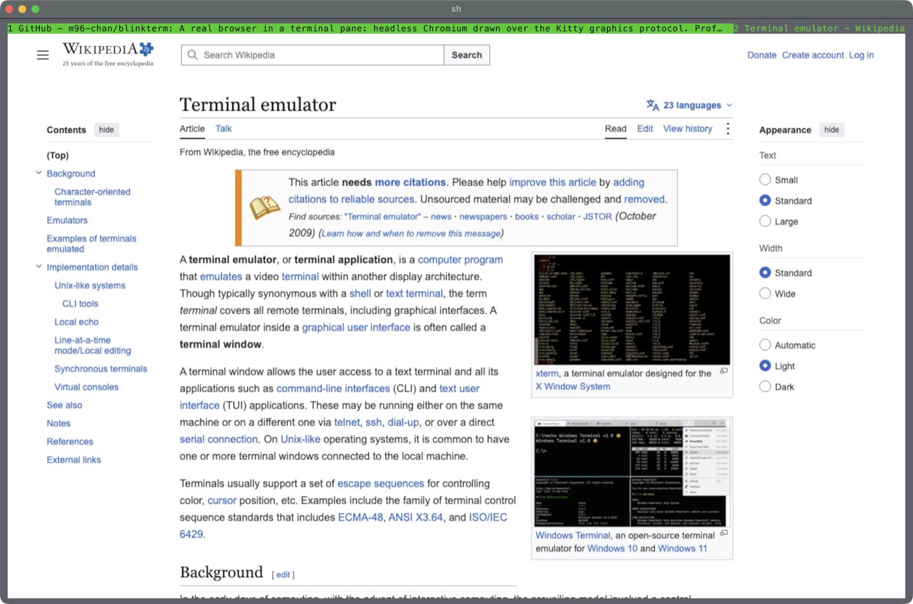

# blinkterm

A real browser in a terminal pane. Not a text browser: the page is rendered by
a headless Chromium — Blink, the engine the page was made for — and arrives in
the pane as pixels, over the Kitty graphics protocol. Images, video, CSS,
JavaScript, the lot, in a terminal.



```sh
blinkterm https://example.com
blinkterm localhost:3000       # this machine gets http://, everything else https://
```

## Philosophy

- **The engine renders, the terminal displays, and blinkterm is the wire
  between them.** Nothing is re-laid-out or approximated: what you see is
  what Chromium drew.
- **A pipe, not a port.** The engine is driven over the DevTools protocol on
  a pipe only the two processes hold, so nothing else on the machine can
  drive your browser. A profile is readable by you alone.
- **Honest to the page.** A person is at the terminal, so the page is not
  told a program is driving it, and the user agent is the engine's own with
  `blinkterm/<version>` on the end. No stealth patches.
- **Nothing leaves the machine unless you say so.** Words typed in the url bar
  go to a search engine only if you configure one. Nothing is bundled: the
  engine and the block lists are yours to choose.
- **Frames cost something, so they are spent carefully.** JPEG while the page
  moves, one lossless PNG when it stops: text you are reading is always
  lossless, and a page at rest costs nothing. Over ssh the frame rate is what
  the link carries.
- **One binary, measured against the real thing.** Rust, with `libc` as its
  only dependency, and a test suite that drives a real Chromium.

## Installing

Rust 1.87 or newer:

```sh
cargo install --locked blinkterm
```

Then a browser engine, which blinkterm does not ship. The one it is tested
against is `chrome-headless-shell` from
[Chrome for Testing](https://googlechromelabs.github.io/chrome-for-testing/).
On a Mac with Apple silicon:

```sh
curl -fsSLO https://storage.googleapis.com/chrome-for-testing-public/153.0.8010.52/mac-arm64/chrome-headless-shell-mac-arm64.zip
unzip chrome-headless-shell-mac-arm64.zip -d ~/engine
mkdir -p ~/.config/blinkterm
echo "engine = $HOME/engine/chrome-headless-shell-mac-arm64/chrome-headless-shell" >> ~/.config/blinkterm/config
```

On x86-64 Linux, the same with `linux64` in place of `mac-arm64`. Any
Chromium on `PATH` (`chromium`, `google-chrome`, …) is found too.
[docs/install.md](docs/install.md) has the rest: Homebrew, Intel Macs, fonts,
and how the engine is looked for.

## Using it

You need a terminal that speaks the Kitty graphics protocol, the Kitty
keyboard protocol and SGR mouse reporting: Kitty, WezTerm, Ghostty, or a
[tOS](https://github.com/m96-chan/tOS) pane. It runs on Linux and macOS,
inside tmux (with `set -g allow-passthrough on`) and over ssh.

| | |
| --- | --- |
| `ctrl+l` | type a url |
| `ctrl+t` / `ctrl+w` | new tab / close tab |
| `ctrl+tab`, `alt+1` … `alt+9` | switch tabs |
| `alt+left` / `alt+right` | back / forward |
| `ctrl+r` | reload |
| `ctrl+f` | find in the page |
| `alt+r` | reader mode |
| `alt+=` / `alt+-` / `alt+0` | zoom in / out / reset |
| `ctrl+q` | quit |

Everything else — profiles, history, bookmarks, downloads, ad blocking,
password managers, rebinding keys — is in the docs.

## Docs

- [Installing](docs/install.md): the engine, per platform, and Homebrew
- [Using blinkterm](docs/usage.md): every key, the status row, opening urls from other programs
- [Settings and profiles](docs/configuration.md): the config file, rebinding keys, profiles, history, the session
- [Features](docs/features.md): ad blocking, downloads, uploads, password managers, sound and permissions, site styles and scripts
- [How it works](docs/design.md): the numbers, terminals, tmux and ssh, what a page is told
- [Development](docs/development.md): the tests and the checks

## Development

```sh
git clone https://github.com/m96-chan/blinkterm
cd blinkterm
cargo build
cargo test          # unit tests; the engine tests skip
```

The tests in `tests/engine.rs` drive a real Chromium, and run only when you
name one:

```sh
BLINKTERM_ENGINE=~/engine/chrome-headless-shell-mac-arm64/chrome-headless-shell \
  cargo test --release -- --test-threads=1
```

Before pushing, run what CI runs: `cargo fmt --all -- --check`,
`cargo clippy --all-targets --locked -- -D warnings` and
`cargo test --locked`. [docs/development.md](docs/development.md) and
[CONTRIBUTING.md](CONTRIBUTING.md) have the details.
[RELEASING.md](RELEASING.md) says what the version number promises,
[CHANGELOG.md](CHANGELOG.md) is what changed, and
[SECURITY.md](SECURITY.md) has the threat model and how to report something
privately.

## Licence

MIT. See [LICENSE](LICENSE).
